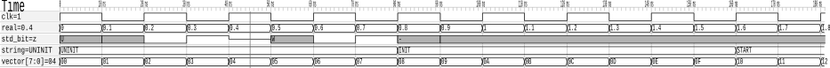

# lib-c-value_change_dump

This library provides functions that can be used to create a value change dump (VCD) file.

A VCD file is a standardized file format used primarily in digital electronics and hardware
simulation to record the changes in signal values over time.
It is most used in hardware description language (HDL) to design and simulation of
digital systems such as FPGAs, ASICs, and other integrated circuits.
The VCD files are typically generated during simulations to analyze signal behavior.
A viewer such as [GTKWave](https://github.com/gtkwave/gtkwave) can be used to display the files.

## Output

The output of GTKWave can be exported as PDF, [output](./docs/gtkwave_output.pdf). The PDF output can optionally be cropped using vector editing programs such as Inkscape. In this way, signals can be displayed very easily.

<picture>
  <source
    media="(prefers-color-scheme: dark)"
    srcset="./docs/gtkwave_output.svg" />
  
</picture>

## Example

```c
bool value_change_dump_test(const char * filename)
{
FILE * f = value_change_dump.Open(filename);

    value_change_dump.Header.Print01_Date(f, __DATE__);
    value_change_dump.Header.Print02_Version(f, "Simple example output");
    value_change_dump.Header.Print03_Timescale(f, "1ns");
    value_change_dump.Header.Print04_ScopeStart(f, "sim");

    value_change_dump.Header.Print05_Vector(f, ID_CLK, 0, 0, "clk");
    value_change_dump.Header.Print05_Bit(f, ID_BIT, "std_bit");
    value_change_dump.Header.Print05_Vector(f, ID_VECTOR, 7, 0, "vector");
    value_change_dump.Header.Print05_Real(f, ID_REAL, "real");
    value_change_dump.Header.Print05_String(f, ID_STRING, "string");

    value_change_dump.Header.Print06_ScopeEnd(f);
    value_change_dump.Header.Print07_Enddef(f);
    value_change_dump.Header.Print08_Dumpvars(f);

    value_change_dump.PrintVector(f, ID_CLK, 1, 1);
    value_change_dump.PrintBit(f, ID_BIT, 5);
    value_change_dump.PrintVector(f, ID_VECTOR, 8, 0);
    value_change_dump.PrintReal(f, ID_REAL, 0.0);
    value_change_dump.PrintString(f, ID_STRING, "UNINIT");

    int clk = 1;
    double real = 0.0;

    for (uint64_t cycle = 0; cycle < SIM_CYCLES; ++cycle, real += 0.1, clk = 1 - clk) {

        value_change_dump.PrintTimestamp(f, cycle * CLK_PERIOD_NS);

        value_change_dump.PrintBit(f, ID_CLK, clk);
        value_change_dump.PrintStdLogic(f, ID_BIT, (char)cycle);
        value_change_dump.PrintVector(f, ID_VECTOR, 8, cycle);
        value_change_dump.PrintReal(f, ID_REAL, real);

        if(cycle == 8)
        {
            value_change_dump.PrintString(f, ID_STRING, "INIT");
        }
        if(cycle == 16)
        {
            value_change_dump.PrintString(f, ID_STRING, "START");
        }
    }

    value_change_dump.Close(f);

    return false;
}
```

## Export as PDF

In Windows with mingw64 there may be problems when exporting as PDF, this is because the ps2pdf application cannot be found by GTKWave. This is because the emulated terminal does not pass the PATH variable correctly. As a workaround, the path of ps2pdf can be added to the PATH variable and then GTKWave can be started with the Windows cmd (not the PowerShell terminal).

```bat
set PATH=C:\msys64\mingw64\bin;%PATH%
gtkwave clk_wave.vcd
```
